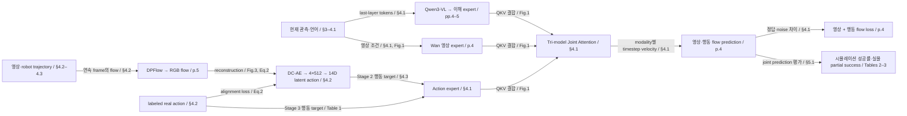

# Motus: A Unified Latent Action World Model

> **TL;DR** — Motus는 pretrained 이해·영상 생성·행동 전문가를 결합하고 optical flow 기반 잠재 행동(latent action)으로 이질적 영상 데이터에서 행동 전문가를 사전학습한다(§4.1–4.3, pp.4–6). RoboTwin randomized 평균 성공률은 87.02%로 X-VLA의 72.84%, π0.5의 43.84%보다 높지만, 이 결과만으로 모든 통합 기능의 품질이나 optical flow 표현의 독립적인 효과까지 입증되지는 않는다(Table 2, p.7; [내 판단]).

**근거 범위와 메타데이터**: 페이지는 파일의 물리적 PDF 페이지 번호다. 본문·참고문헌을 포함한 pp.1–13을 읽었고, 본문이 참조한 Table 9·10은 이 PDF에 없다(§5.3, p.7; pp.9–13). 따라서 그 표의 세부 평가 규칙은 확인하지 않았다. PDF p.1의 CVPR Open Access 표기와 [CVF proceedings 메타데이터·BibTeX](https://openaccess.thecvf.com/content/CVPR2026/html/Bi_Motus_A_Unified_Latent_Action_World_Model_CVPR_2026_paper.html)를 교차 확인했다. [arXiv 메타데이터](https://arxiv.org/abs/2512.13030)는 최초 공개 연도가 2025임을 보여주며, 파일명·venue 기준 연도는 2026으로 유지한다. DOI는 arXiv DOI이며 proceedings DOI는 [확인 필요]. `paper.py meta` 조회는 실패하여 같은 원출처의 arXiv 웹페이지로 교차 확인했다. [공식 코드 README](https://github.com/thu-ml/Motus)는 코드·체크포인트 공개 여부만 보강하며 PDF의 실험 설정을 대체하지 않는다(확인일 2026-10-06).

## 5축 분석 요약

| 축 | 요약·판정 | 근거 위치 |
|---|---|---|
| 1. 문제와 기존 연구 | 모델 기능 분절과 embodiment별 action label 부족을 함께 다룬다. [내 판단] 타당한 연구 문제지만 통합 자체는 UWM에도 선행한다. | §2–3, p.3 |
| 2. 핵심 아이디어와 차이 | MoT의 Tri-model Joint Attention, modality별 flow timestep, optical flow latent action, 단계별 학습을 결합한다. | §4.1–4.3, Figs.1–4, pp.2–6 |
| 3. 성능 지표와 검증 | randomized 성공률 87.02%; real-world는 완전 성공률이 아닌 partial success를 평가한다. [내 판단] 정책 성능 개선의 근거가 통합 기능 전체 검증보다 강하다. | §5.2–5.4, Tables 2–5, pp.6–8 |
| 4. 한계와 확장 방향 | [내 판단] flow 표현의 독립 ablation, compute 통제, 기능별 평가, seed·분산이 부족하다. 단계별 freeze 범위와 평가 세부 규칙도 불명확하다. | §4.2–4.3, Table 1, §5, pp.5–8 |
| 5. 관련 연구 속 위치 | UWM의 분포 통합과 Bagel/MoT의 expert 결합, LAOM의 약한 action supervision을 이어받은 조합이다. [내 판단] 개별 원리보다 사전학습 recipe 통합에 가치가 있다. | §2, pp.3; §4.1–4.2, pp.4–5 |

## 1. 문제와 동기

- **문제**: 언어 조건 로봇 조작에서 시각·언어 이해, 미래 영상 예측, 행동 예측을 하나의 모델로 처리하면서 action label이 없는 영상도 학습에 활용한다(§1, pp.1–2; §3, pp.3–4).
- **기존 방식의 부족함 — 저자 진단**: VLA, world model, IDM, video generator, video-action joint predictor가 분리되어 있고, robot마다 행동 공간의 차원·범위·의미가 달라 제어 신호의 직접 재사용이 어렵다. UWM은 통합 방향을 제시하지만 VLM·VGM prior를 모두 활용하지 못한다는 것이 저자의 비교다(§1–3, pp.1–4).
- **[내 의견]**: 통합 학습과 unlabeled video 활용은 유용한 문제 설정이다. 다만 공유 2D motion이 곧 robot 제어 의미를 공유한다는 결론은 따로 검증해야 한다. 논문 자체도 실제 action label로 정렬을 보완한다(§4.2, p.5).

## 2. 핵심 기여

| # | 저자 주장 기여 | 위치 | 실제로 새로운가 [내 판단] |
|---|---|---|---|
| 1 | 이해·영상·행동 전문가와 scheduler로 다섯 모델링 paradigm 통합 | §1, p.2; §4.1, p.4 | UWM의 통합과 MoT의 공유 attention을 잇는 설계다. 통합 분포 자체의 최초 제안으로 읽으면 안 된다(§2.1, p.3). |
| 2 | optical flow latent action을 활용한 단계별 학습과 data pyramid | §4.2–4.3, pp.5–6 | flow reconstruction과 약한 action supervision의 결합이 구체적인 차이다. 표현 선택과 데이터 확대의 효과는 분리되지 않았다. |
| 3 | 시뮬레이션·실물 로봇 성능 개선 | §5, Tables 2–3, pp.6–8 | 평균 개선은 확인된다. 모든 task에서 우월하거나 모든 통합 기능이 검증된 것은 아니다. |

## 3. 방법 (Method)

### 3.0 한눈 구조도



구조도는 Fig.1의 각 expert 블록 안에서 반복되는 attention과 Fig.3의 별도 latent-action 학습을 압축했다(§4.1–4.2, pp.4–5). Qwen3-VL token 입력은 이해 expert의 입력이며, latent action은 Stage 2의 학습 target이다. 실제 테스트 시 정답 미래 latent action을 입력한다는 뜻이 아니다(§4.1, p.5; §4.3, p.5). 노드 간선의 근거는 라벨의 절·그림·수식이다.

### 3.1 한 문단 개요

현재 관측 $o_t$와 언어 $\ell$로 미래 observation chunk와 action chunk를 생성한다. 영상 전문가는 Wan 2.2 5B, 이해 입력 encoder는 Qwen3-VL-2B이며, 행동 expert는 Wan과 같은 깊이의 Transformer다. 전문가별 normalization·FFN을 유지하고 self-attention context를 결합한다. Rectified flow의 modality별 timestep으로 조건부·주변·공동 분포를 학습하며, 영상은 행동보다 드물게 예측한다(§3–4.1, pp.3–5; Fig.1–2). 사전학습에서는 optical flow에서 얻은 latent action, target robot 미세조정에서는 실제 action을 사용한다(§4.2–4.3, Table 1, pp.5–6).

### 3.2 표기와 정의

| 기호 | 의미·형태 | 근거 |
|---|---|---|
| $o_t,\ell,p_t$ | visual observation, instruction, proprioception; observation 크기와 proprioception 차원은 미기재 | §3, p.3 |
| $a_{t+1:t+k}$ | 미래 action chunk; target별 전체 차원과 $k$ 값은 미기재 | §3, p.3; §4.1, p.4 |
| $z_t$ | optical flow의 14차원 latent action; 중간 표현은 네 개의 512차원 token | §4.2, p.5 |
| $\tau_a,\tau_o$ | 행동·영상의 flow timestep; $U(0,T_\tau)$에서 sampling | §4.1, p.4 |
| $\epsilon_a,\epsilon_o; v_a^\theta,v_o^\theta$ | Gaussian noise와 예측 velocity field | §4.1, p.4 |
| $\lambda_a,\beta$ | action alignment와 KL 항의 가중치; 값은 미기재 | Eq.2, p.5 |

### 3.3 수식·학습·추론

**정책 목표**: expert trajectory에서 action chunk의 조건부 likelihood를 최대화한다(§3, p.3, Eq.1).

$$\max_\theta\;\mathbb E_{(o_t,p_t,a_{t+1:t+k},\ell)\sim D_{expert}}\log p_\theta(a_{t+1:t+k}\mid o_t,p_t,\ell).$$

직관: 관측·지시·상태가 주어졌을 때 demonstration과 같은 행동을 내도록 학습한다. §3은 proprioception을 포함하는 정책과 포함하지 않는 정책 모두를 정의하며, §4 이후 실제 사용 경로의 세부 명세는 불충분하다(§3–4.1, pp.3–4; [내 판단]).

**Motus flow loss**: 다음 식은 §4.1 p.4의 번호 없는 수식이다. 가상의 Eq. 번호를 붙이지 않는다.

$$\mathcal L_{action}=\mathbb E_{D,\tau_a,\epsilon_a}\|v_a^\theta-(\epsilon_a-a_{t+1:t+k})\|_2^2,$$
$$\mathcal L_{obs}=\mathbb E_{D,\tau_o,\epsilon_o}\|v_o^\theta-(\epsilon_o-o_{t+1:t+k})\|_2^2,\qquad \mathcal L=\mathcal L_{action}+\mathcal L_{obs}.$$

각 modality의 정답에서 noise로 향하는 velocity를 회귀한다(§4.1, p.4). 저자는 서로 다른 timestep·noise scale을 배분하여 VLA, world model, IDM, VGM, joint prediction으로 전환한다고 설명한다. 그러나 mode별 timestep 고정값, condition mask, noise interpolation 및 solver의 정확한 실행 알고리즘은 이 PDF에 미기재다(§3–4.1, pp.3–4). [추론] 조건 modality의 noise를 고정하고 생성 modality만 적분하는 구현이 가능하지만, 이를 이 논문의 확인된 설정으로 쓰지는 않는다.

**Latent-action VAE**: DPFlow로 연속 frame flow를 계산하여 RGB로 변환하고, DC-AE와 lightweight encoder로 압축한다. task-agnostic robot data는 Curobo로 target action space를 무작위 sampling하여 만든다. 학습 데이터는 unlabeled 90%, labeled 10%로 섞으며 labeled에는 task-agnostic data와 demonstration이 포함된다(§4.2, Fig.3, p.5).

$$\mathcal L_{VAE}=\mathcal L_{recon}+\lambda_a\|a_{real}-a_{pred}\|_2+\beta\mathcal L_{KL}.\tag{논문 Eq.2}$$

flow 복원은 motion 정보를 보존하고, action alignment는 실제 control과의 연결을 유도하며, KL 항은 latent 공간을 regularize한다(§4.2, Eq.2, p.5). Eq.2의 alignment norm에는 제곱이 표시되지 않으므로 임의로 squared MSE로 바꾸지 않았다. reconstruction의 정확한 norm, action decoder의 세부 구조, KL prior는 미기재다(§4.2, p.5).

**학습 순서**(§4.3, Table 1, pp.5–6):

1. Off-the-shelf VGM·VLM은 Level 1 web data의 prior를 가져온다. Motus가 Level 1 전체를 새로 학습했다는 의미는 아니다.
2. Stage 1은 Level 2 egocentric human, Level 3 synthetic, Level 5 multi-robot task trajectory로 VGM만 적응한다.
3. Stage 2는 위 데이터와 Level 4 task-agnostic data에 latent action을 붙여 Motus를 학습한다. 본문은 VLM frozen이라고 쓰지만 Table 1은 all three experts라고 표현한다. encoder VLM과 이해 expert가 구분되므로 반드시 논리적 모순은 아니며 세부 freeze 범위는 [확인 필요].
4. Stage 3은 Level 6 target-robot task trajectory의 실제 action으로 미세조정한다.

optimizer, learning rate, batch size, Stage 1·2의 step 수 및 데이터별 sampling weight는 미기재다(§4.3, pp.5–6). 영상 frame rate를 action rate의 1/6로 두는 것은 §4.1의 예시이며, 모든 실험의 고정 설정으로 단정하지 않는다(§4.1, Fig.2, p.4).

**추론**: 현재 이미지·언어를 condition으로 공동 예측 mode에서 미래 영상과 action chunk를 생성하여 정책을 평가한다(§5.1, p.6; §4.1, p.4). denoising step 수, 재계획 주기, chunk 중 실행할 action 수, latency 및 비디오를 계획에 재사용하는 feedback 경로는 미기재다(§4.1, §5, pp.4–8).

### 3.4 작동 원리의 주장과 검증

저자는 expert별 기능 보존과 cross-modal fusion, sparse video로 token 균형 확보, flow와 약한 supervision으로 control 정렬을 설명한다(§4.1–4.2, pp.4–5). [내 판단] expert 제거와 scheduler 변경은 정책 성능 기여를 뒷받침하지만, task interference 감소·token imbalance 해소·embodiment 불변 정렬을 직접 측정하지 않는다(Tables 4–5, p.8). 차원 대응만으로 physical control의 동일성이 보장되지는 않는다.

## 4. 실험 설정

| 항목 | 내용 | 위치 |
|---|---|---|
| 사전학습 데이터 | Egodex, RoboTwin, AgiBot-World, RDT, RoboMIND 관련 인용과 data pyramid; 데이터별 실제 사용량·split·중복 제거 미기재 | §4.3, p.6, refs.[1,15,27,36,55] |
| 시뮬레이션 데이터 | RoboTwin 2.0의 50 task, clean 2,500개(50/task), randomized 25,000개(500/task)를 합쳐 multi-task training | §5.2, p.6 |
| randomization | background, table clutter, table height, lighting | §5.2, p.6 |
| 실물 데이터 | AC-One·Agilex-Aloha-2; task당 100 trajectory, platform별 하나의 multi-task 모델 | §5.3, p.7 |
| 지표 | 시뮬레이션 task당 100 execution trial의 성공률; 실물은 subgoal별 점수를 주는 partial success | §5.2–5.3, pp.6–7; Tables 2–3 |
| baseline | π0.5·X-VLA(시뮬레이션), π0.5(실물), w/o Pretrain·Stage1 | §5.1, p.6 |
| 모델 규모 | Wan 2.2 5B, Qwen3-VL-2B; 전체 parameter 수·expert별 세부 크기는 PDF에 미기재 | §4.1, pp.4–5 |
| 학습 길이 | main simulation은 pretrained checkpoint부터 100K step; ablation은 27.5K demonstration·50K step from scratch라고 서술 | §5.2, p.6; §5.4, p.7 |
| 기타 hyperparameter | optimizer, LR, batch, image resolution, action chunk 길이, loss weights 미기재 | §4–5, pp.4–8 |
| 컴퓨트·학습 시간 | GPU 종류·개수, GPU-hours, peak memory, latency 미기재 | §4–5, pp.4–8 |
| seed·반복·불확실성 | training seed, seed별 반복, CI·SD 미기재; trial 수를 seed 반복으로 해석하지 않음 | §5.2–5.4, Tables 2–5, pp.6–8 |

## 5. 결과 — 주장과 증거의 대응

| 저자 주장 | 근거 결과 | 위치 | 판정 [내 판단] |
|---|---|---|---|
| 시뮬레이션 정책 성능 우수 | clean: Motus 88.66%, X-VLA 72.80%, π0.5 42.98%; randomized: 87.02%, 72.84%, 43.84% | Table 2, p.7 | 평균 우위는 지지. 기존 pretrained checkpoint와 자원 차이를 통제한 구조 효과는 아님. |
| 사전학습이 기여 | randomized: w/o Pretrain 77.00%, Stage1 81.86%, full 87.02% | Table 2, p.7 | recipe의 누적 효과. Stage 2의 latent action과 추가 데이터·학습량의 효과를 분리하지 못함. |
| 실물 평균 성능 개선 | AC-One: π0.5 14.79%, w/o Pretrain 25.86%, Motus 63.22%; Agilex: 48.60%, 26.60%, 59.30% | Table 3, p.8 | partial success의 평균 개선을 지지. 전체 task 완수 확률과 구분해야 함. |
| 모든 real-world task에서 baseline 우월 | Agilex Put Bread into Oven: Motus 34%, π0.5 36%; AC-One keyboard: Motus 82.5%, w/o Pretrain 100% | §5.3, p.7; Table 3, p.8 | 저자의 “across all tasks”는 표와 불일치. 평균 우위로 한정해야 함. |
| 통합한 모든 기능·prior가 유익 | expert·scheduler ablation에서 정책 성공률 차이 | Tables 4–5, p.8 | 기능별 영상 품질·action-conditioned prediction·IDM accuracy 평가를 제시하지 않아 전체 기능 품질은 검증 부족. |
| scaling·data efficiency 우수 | 저자는 1.77× 성공률, 동일 budget에서 최대 2.61×, 13.55× data efficiency를 보고 | §5.4, Fig.7, p.8 | figure 축·원시 좌표가 text 추출에 없어 숫자는 본문 주장으로만 기록. 보편적 scaling law로 확장 불가. |

**핵심 차이 계산**: randomized Motus–X-VLA는 $87.02-72.84=14.18$%p, Motus–π0.5는 $87.02-43.84=43.18$%p다. clean 차이는 각각 15.86%p와 45.68%p다(Table 2, p.7; [계산]). 따라서 초록의 +15%·+45%를 randomized의 정확한 절대 차이로 인용하지 않는다(Abstract, p.1; §5.2, p.6; Table 2, p.7). 실물 평균 차이는 AC-One 48.43%p, Agilex 10.70%p로, 이 역시 상대 증가율이 아닌 partial-success percentage-point 차이다(Table 3, p.8; [계산]).

## 6. Ablation / 분석

| 제거·변경 | 결과 | 위치 | 해석 [내 판단] |
|---|---|---|---|
| VLM 및 이해 expert 제거 | full 77.00% → 64.94%, −12.06%p [계산] | Table 4, p.8 | 이해 branch의 기여. VLM만의 효과로 한정할 수 없음. |
| VGM 제거 | 77.00% → 25.50%, −51.50%p [계산] | Table 4, p.8 | 큰 기여이나 모델 용량·연산·학습 신호도 함께 바뀜. |
| asynchronous 대신 synchronous scheduler | UniDiffuser 77.00%, Joint Diffuser 67.21%, 차이 9.79%p [계산] | Table 5, p.8 | 해당 from-scratch ablation 조건의 정책 성능 증거. |
| Stage 1·2 누적 적용 | randomized 77.00% → 81.86% → 87.02%; 증분 4.86·5.16%p [계산] | Table 2, p.7 | main 결과 기준; §5.4의 50K ablation과 같은 실험인지 불명확하므로 합치지 않음. |

빠진 ablation [내 판단]: 동일 데이터·compute의 RGB latent 대 optical flow latent, supervision 비율 변경, task-agnostic 데이터 제거, latent 차원 변경, video sparsity 변경, modality간 attention 차단. 이 비교 없이는 §4의 구체적인 causal 설명을 분리해 검증할 수 없다(§4.1–4.3, pp.4–6; Tables 4–5, p.8).

## 7. 한계와 비판

**저자가 밝힌 방향**: §6은 더 깊은 VLM 통합과 internet-scale universal video에서의 latent action 학습을 후속 방향으로 제시한다. 섹션 제목은 Conclusion and Limitations지만 구체적인 실패 조건을 별도로 기술하지 않는다(§6, p.8).

**내가 찾은 문제**:

- **[방법, 내 판단]** flow의 camera motion과 object motion 분리, depth·occlusion 처리, embodiment별 latent 정렬 검증이 없다. 따라서 화면의 motion 압축을 embodiment-agnostic control prior로 일반화하는 주장은 추가 근거가 필요하다(§4.2, p.5).
- **[실험, 내 판단]** full recipe와 비교군의 pretrained data·parameter·총 compute가 통제되지 않는다. expert 제거는 capacity와 supervision도 제거하므로 MoT 결합의 고유 효과를 식별하지 못한다(§5.1–5.4, Tables 2–5, pp.6–8).
- **[비교군, 내 판단]** UWM·F1·다른 latent-action 접근은 논문에서 직접 논의되지만 정량 비교는 π0.5와 X-VLA 중심이다. 통합 방식 및 latent action의 상대 이점은 이 baseline 구성이 검증하지 않는다(§2, p.3; §5.1, p.6).
- **[평가, 내 판단]** 실물 partial success의 subgoal weight, trial 수, 세부 성공 기준을 이 PDF에서 확인할 수 없다. Table 9·10 참조만 있고 해당 표가 없다. 실제 task 완수 능력과 통계적 안정성을 판단하기 어렵다(§5.3, p.7; Table 3, p.8).
- **[일반화, 내 판단]** randomization과 platform별 fine-tuning은 zero-shot 새 embodiment transfer를 입증하지 않는다. pretraining·test 데이터의 중복 제거·유출 점검도 미기재라 오염의 존재나 부재를 단정할 수 없다(§4.3–5.3, pp.5–7).
- **[서술, 내 판단]** randomized “over 45% absolute”와 “all tasks”는 각각 Table 2의 43.18%p [계산] 및 Table 3의 Agilex oven 예외와 어긋난다(§5.2–5.3, pp.6–7; Tables 2–3, pp.7–8). 통합 능력 전체의 우월함과 정책 평균 성능을 구분해야 한다.

## 8. 재현성 체크

| 항목 | 상태 | 근거·한계 |
|---|---|---|
| 코드 공개 | 예, URL 확인 | [공식 저장소](https://github.com/thu-ml/Motus); 실행 검증은 하지 않음 |
| 학습 데이터 접근 | 일부 공개 자원 인용; 전체 recipe 재현 가능 여부 [확인 필요] | §4.3, p.6의 인용 자료; 정확한 사용량·실물 데이터 공개 범위 미기재 |
| checkpoint 공개 | 예, 공식 README에 stage별 링크 | [README Model Checkpoints](https://github.com/thu-ml/Motus#model-checkpoints); 다운로드·수치 재현 미실행 |
| hyperparameter 전부 명시 | 아니오, 제공 PDF 기준 | §4–5, pp.4–8; LR·batch·loss weights 등 미기재 |
| compute 요구량 명시 | PDF에 미기재 | 공식 README의 운영 요구사항과 실제 논문 run의 GPU-hours를 구분 |
| 분산·seed 보고 | PDF에 미기재 | §5, Tables 2–5, pp.6–8 |

[내 판단] 재현의 최대 장애는 latent-action VAE의 구체적 supervision·decoder·loss weight, stage별 data mixture·freeze 범위, scheduler mode 전환 알고리즘, partial-success scoring이다. recipe 명칭만으로 같은 실험을 재현할 수 없다(§4.1–5.4, pp.4–8).

## 9. 관련 연구 속 위치

- **직접적인 구조 기반**: Bagel과 MoT는 understanding·generation의 shared self-attention 설계 맥락이고, Motus는 행동 expert까지 결합한다(§2.1, p.3; §4.1, p.4; refs.[20,35]).
- **모델링 선행**: UWM은 이미 다섯 분포를 단일 diffusion backbone에 통합한다. Motus의 저자 주장 차이는 pretrained VLM·VGM prior와 이질적 데이터 recipe다(§2.1, p.3; §4.1, p.4; ref.[72]).
- **표현 학습 선행**: LAOM의 action supervision, DC-AE 압축, DPFlow, AnyPos의 task-agnostic robot data를 잇는다(§2.2, p.3; §4.2, p.5; refs.[14,38,40,45]).
- **대안**: F1은 future visual observation을 상상하고 IDM으로 행동을 추론하는 것으로 저자가 비교한다. π0.5와 X-VLA는 본 논문의 정책 성능 baseline이다(§1–2, pp.1–3; §5.1, p.6; refs.[8,37,67]). 여기서 다른 논문의 사실은 Motus가 기술한 범위이며 독립 원문 검증을 뜻하지 않는다.
- **후속 연구**: [확인 필요] 이 리뷰는 지정된 논문만 다루며 citation 추적을 수행하지 않았다.

[내 판단] 한 줄 위치: 기존 통합 분포·expert 설계·약한 latent action supervision을 결합해 로봇 정책의 사전학습을 확장한 recipe 연구다(§2–4, pp.3–6).

## 10. 시사점과 후속 아이디어

- [내 의견] 재사용할 설계는 pretrained specialist를 shared attention으로 연결하고 action label 없는 영상에 motion target을 부여하는 것이다(§4.1–4.3, pp.4–6).
- [내 의견] 우선 실험은 데이터·총 FLOPs를 맞춘 RGB/flow latent 비교와 camera-motion perturbation이다. action alignment가 appearance·camera shortcut을 실제로 줄이는지 측정해야 한다(§4.2의 동기, p.5).
- [내 의견] 다섯 mode를 같은 checkpoint로 전환하며 정책 성공률, action-conditioned video error, IDM accuracy를 별도로 측정하면 “통합”의 실질적 범위를 확인할 수 있다(§3–4.1, pp.3–4).

## 11. 미해결 질문

1. Stage 2의 frozen VLM과 학습하는 understanding expert를 정확히 어떻게 구분하며, Stage 3의 freeze 범위는 무엇인가(Table 1, §4.3, pp.5–6)?
2. 각 mode의 timestep·condition mask·solver와 실제 action chunk 길이, 실행 주기는 무엇인가(§4.1, p.4)?
3. VAE의 action alignment decoder, $\lambda_a,\beta$, normalization과 서로 다른 robot action dimension 처리는 무엇인가(§4.2, Eq.2, p.5)?
4. main의 100K step와 ablation의 50K step 설정을 training-stage 비교에 어떻게 적용했는가(§5.2, §5.4, pp.6–7)?
5. Table 9·10의 scoring, 실물 trial 수, 시드별 분산과 pretraining/test 중복 제거 결과를 제공할 수 있는가(§5.3, p.7)?
6. Fig.7의 원시 데이터·오차막대·budget 정의는 무엇인가(§5.4, p.8)?

## 12. 인용

아래는 CVF 공식 메타데이터의 BibTeX다. 조회 결과를 사용하며 proceedings DOI를 만들지 않았다([CVF](https://openaccess.thecvf.com/content/CVPR2026/html/Bi_Motus_A_Unified_Latent_Action_World_Model_CVPR_2026_paper.html)).

```bibtex
@InProceedings{Bi_2026_CVPR,
  author = {Bi, Hongzhe and Tan, Hengkai and Xie, Shenghao and Wang, Zeyuan and Huang, Shuhe and Liu, Haitian and Zhao, Ruowen and Feng, Yao and Xiang, Chendong and Rong, Yinze and Zhao, Hongyan and Liu, Hanyu and Su, Zhizhong and Ma, Lei and Su, Hang and Zhu, Jun},
  title = {Motus: A Unified Latent Action World Model},
  booktitle = {Proceedings of the IEEE/CVF Conference on Computer Vision and Pattern Recognition (CVPR)},
  month = {June},
  year = {2026},
  pages = {35101-35113}
}
```

---

**품질 점검**: 주장–증거 표, 입력·출력·loss·학습 단계, 실험 설정과 미기재 항목, 주장과 관찰의 구분, 독립 비판, 수치별 위치 표기를 대조했다. 구조도는 확인된 flow만 담았고 미확인 solver는 채우지 않았다. Fig.6–7의 그래픽 내부 숫자는 텍스트 추출로 확인하지 못해 추가 수치를 만들지 않았다.

**3패스 읽기 기록**: 1패스는 pp.1–3의 초록·서론·관련 연구·문제, pp.4–8의 heading·caption·결론을 읽어 정독 계획을 세웠다. 2패스는 pp.4–7의 방법·실험, pp.8–10의 결과·결론·참고문헌, pp.11–13의 나머지 참고문헌을 읽었다. 3패스는 pp.7–8을 재독하고 §4–5의 설정과 결과를 대조했다. Read pages 도구가 없는 headless worker이므로 `pdfinfo`의 13쪽 확인 후 `pdftotext -f/-l -layout ... -`로 1–3, 4–7, 4, 8–10, 11–13, 7–8쪽을 추출하여 context에서 읽었다. 각 범위는 10쪽 이하이며 form-feed와 footer 35101–35113으로 경계를 확인했다. 별도 supplementary source는 읽지 않았다. 요청 범위에 따라 개념 후보·Keep 파일은 만들지 않았다.

*리뷰 작성: 2026-10-06 · 읽은 범위: 제공 PDF 전체 pp.1–13(본문 §1–6 및 references); Table 9·10 미포함*
